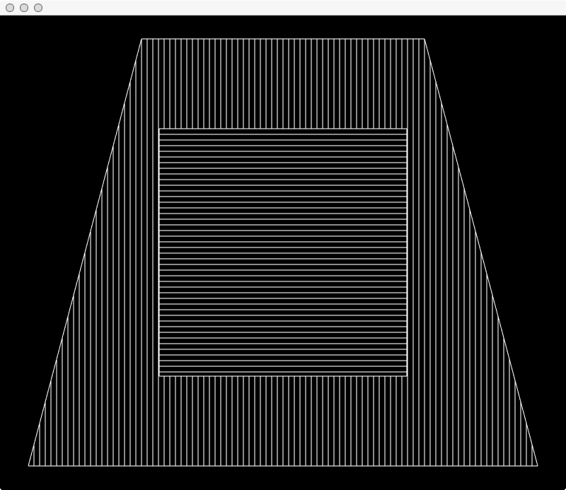

This is one possible way to render Wall Drawing #327 by Sol LeWitt (1928-2007).

_Wall Drawing #327_

> On a black wall, a white trapezoid within which are white vertical parallel lines and a white square within which are white horizontal parallel lines. The vertical lines within the trapezoid do not enter the square, and the horizontal lines within the square do not enter the trapezoid.

