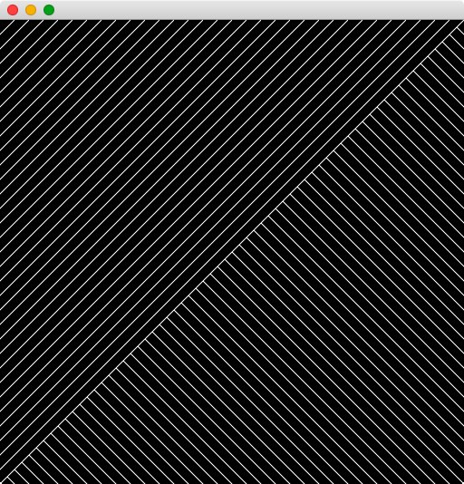
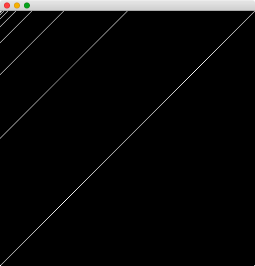

# Assignment 01

Create the following images using openFrameworks.

## Image_00
- Use at least one `for` loop.
- Use a `float` variable to control the distance between the lines.


## Image_01
- Use at least one `for` loop.
- Use a `float` variable to control the distance between the lines.



## Image_02
- Use at least one `for` loop.
- Each line drawn, should be 2 times the distance of the last line.



## Image_03
- Use at least one `for` loop.
- Each line drawn, should be 2 times the distance of the last line.


## Image_04
- Use at least one `for` loop.
- The color of each line should vary according to the image.
- Consider setting the colors using something like:

```c++
// x may be the current drawing position
float hue = ofMap(x, 0, width, 0, 255);
ofSetColor(ofColor::fromHsb(hue, 255, 255));
```

and / or

```c++
// x may be the current drawing position
float grayscale = ofMap(x, 0, width, 0, 255);
ofSetColor(grayscale);
```

See the documentation and examples for `ofMap` and `ofColor` for more info.


