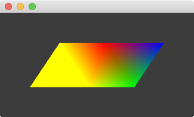

This example examines the basics of creating a shape using `ofMesh`. It builds upon the previous example by adding per-vertex colors and demonstrating basic per-vertex color blending. It then goes on to introduce the idea of vertex 'indices', which can be used to create more complex shapes without adding redundant vertex data.
