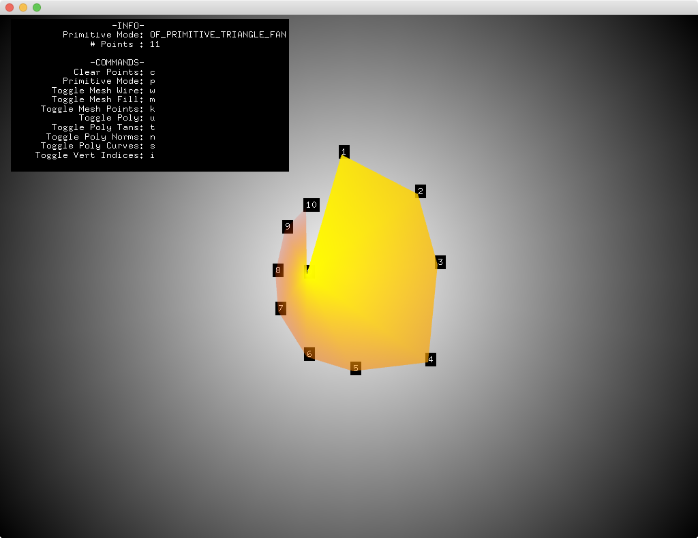

This example allows for the interactive exploration of the `ofMesh` modes. While `ofMesh` is always constructed with the same basic process (add vertices, colors, texture coordinates, etc), the `ofPrimitiveMode` determines how that per-vertex data is interpreted and rendered.

Using keyboard commands and mouse interaction, this examples allows users to reinterpret the same mouse generated points using different primitive modes.
