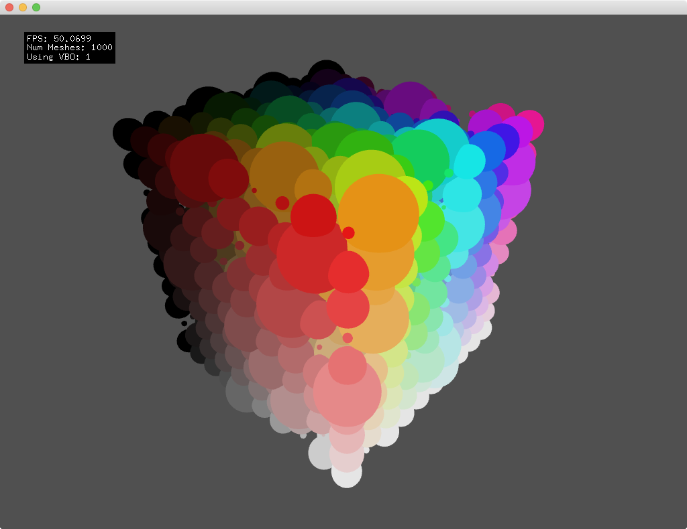

This example compares `ofVboMesh` to a standard `ofVboMesh`. In some cases where multiple instances of the same mesh are used, it is significantly faster to use an `ofVboMesh`. Unlike the `ofMesh`, the `ofVboMesh` stores the mesh data on the graphics card allowing for much faster rendering of many instances of the same `ofVboMesh`.
