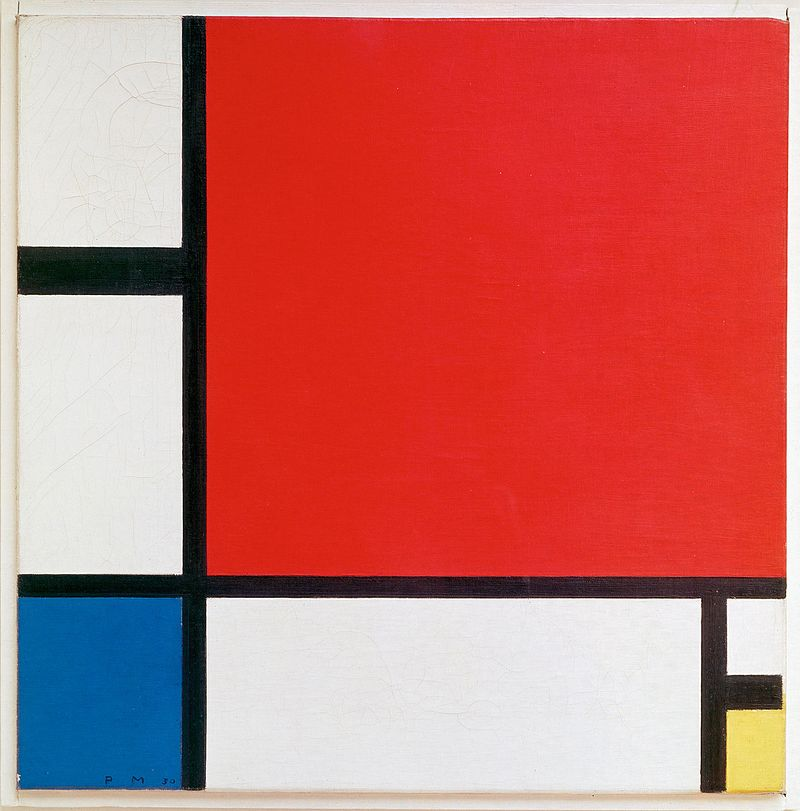

# About Mondrian

After Mondrian's _Composition in Red Blue and Yellow_ (1930)

(via [Wikipedia](https://en.wikipedia.org/wiki/Composition_with_Red_Blue_and_Yellow))

### Learning Objectives

- Understand the coordinate system.
- Understand drawing using `ofDrawRectangle`
- Understand `float` variables that respond to the varying size of the window and are used to dynamically resize all of the rectangles.
- Understand the use of `ofGetKeyPressed`.
- Understand the basic use of `ofImage` and `ofColor`.

### Expected Behavior

This should produce a static algorithmically drawn image of Mondrian's composition.

Resizing the window should preserve the proportions of the original piece.

### Instructions for use:

- Press the `spacebar` to flip between the original image and the rendering.

- Drag the corner of the window to resize.

### Other classes used in this file

This example uses `ofColor` and `ofImage`.